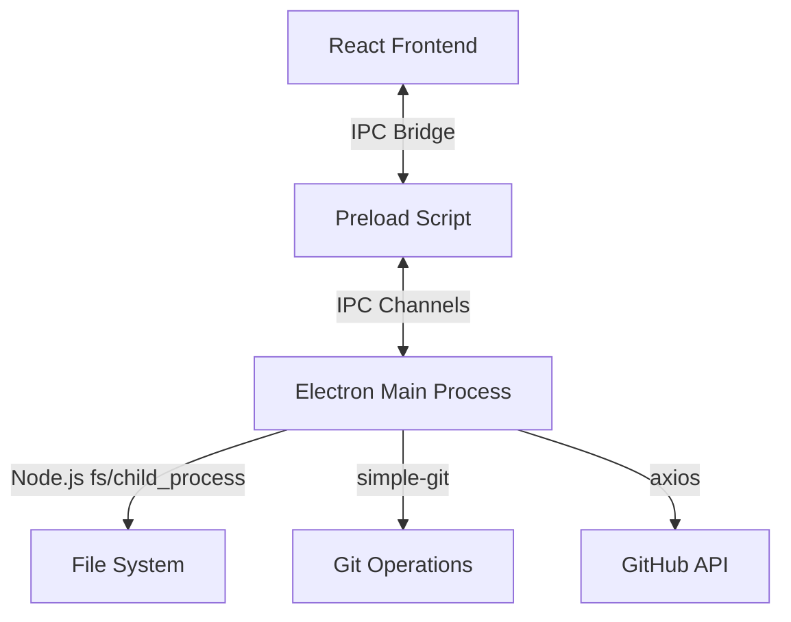

<div align="center">

# Zen Addons Manager & Launcher

### A modern, beautiful World of Warcraft addon manager and launcher

[](LICENSE)

[Features](#-features) • [Installation](#-installation) • [Power Users](#-for-power-users) • [Development](#-development)

</div>

---

## ✨ Features

### 🎨 **Modern Dark Theme**
Clean, neutral dark theme designed for focus and clarity. Built with Shadcn UI for a professional look. Now features a consistent **Right Sidebar** across the dashboard and management pages for quick access to profile stats and news.

### 🌍 **Multi-Version WoW Support**
Manage addons across **all** WoW versions:
- Vanilla (1.12)
- The Burning Crusade (2.4.3)
- Wrath of the Lich King (3.3.5)
- Cataclysm (4.3.4)
- Mists of Pandaria (5.4.8)
- Retail & Classic (SoD)

### ⚡ **Lightning Fast Operations**
- **Drag-and-drop** installation - just drop .zip files onto the addon list
- **Bulk operations** - enable, disable, update, or remove multiple addons at once
- **Parallel updates** - update all Git addons simultaneously
- **Smart auto-detection** - finds your WoW installations automatically

### 🎮 **Game Integration**
- **Play time tracking** - see when you last played each WoW installation
- **Direct game launch** - start WoW right from the manager
- **Installation profiles** - switch between WoW versions instantly

### 🐙 **GitHub Integration**
- **Featured addons** - curated list of popular WoW addons on launch
- **GitHub profile pictures** - see addon creators' avatars
- **Smart search** - find any WoW addon from GitHub
- **Git repository support** - install directly from Git with branch switching

---

## 📦 Installation

### Windows
Download the latest `.exe` installer from [Releases](https://github.com/Zendevve/zen-addons-manager/releases) and run it.

### Build from Source
```bash
# Clone the repository
git clone https://github.com/Zendevve/zen-addons-manager.git
cd zen-addons-manager

# Install dependencies
npm install

# Build the app
npm run build

# Package for Windows
npm run package
```

---

## 🚀 For Power Users

Zen Addons Manager is built to be simple, but it has powerful features under the hood for advanced users.

### Git-Based Addon Management
Unlike traditional managers that just download zips, Zen Addons Manager treats Git repositories as first-class citizens.
- **Clone & Pull**: When you install from a GitHub URL, it performs a `git clone`. Updates are just a `git pull`.
- **Branch Switching**: Working on a dev branch? You can switch branches directly from the UI.
- **Local Development**: Point the manager to your local addon development folder. It will recognize `.git` directories and enable version control features.

### TOC Parsing & Validation
The manager intelligently parses `.toc` files to determine:
- **Real Addon Name**: Uses `## Title` instead of folder name.
- **Version Compatibility**: Checks `## Interface` to warn about version mismatches.
- **Dependencies**: (Coming soon) Resolves dependencies automatically.

### Cross-Drive Installation
We handle the tricky `EXDEV` errors that happen when moving files between drives (e.g., downloading to C: temp and installing to D: games). The manager automatically falls back to a copy-and-delete strategy if a simple rename fails.

---

## 🛠 Development

### Architecture Overview

Zen Addons Manager uses a secure, modern Electron architecture:



- **Frontend**: React 18, TypeScript, Vite, Tailwind CSS, Shadcn UI.
- **Backend**: Electron (Main Process) handling all system operations.
- **Communication**: Context-isolated IPC bridge. The frontend **never** touches Node.js directly.

### Project Structure

```
src/
├── components/
│   ├── Layout.tsx          # Main app layout
│   ├── RightSidebar.tsx    # Reusable sidebar (Profile/News)
│   └── ui/                 # Shadcn UI components
├── pages/
│   ├── Dashboard.tsx       # Home page with stats
│   ├── Manage.tsx          # Addon management
│   ├── Browse.tsx          # Discover addons
│   └── Settings.tsx        # WoW installation config
├── services/
│   ├── electron.ts         # Typed IPC wrapper
│   └── storage.ts          # LocalStorage wrapper
└── types/
    ├── addon.ts            # Addon interfaces
    └── installation.ts     # WoW installation types

electron/
├── main.ts                 # Electron main process (Node.js)
└── preload.ts              # IPC bridge (Security layer)
```

### Key Technologies

- **Electron**: Desktop runtime.
- **React**: UI library.
- **Vite**: Blazing fast build tool.
- **Tailwind CSS**: Utility-first styling.
- **Shadcn UI**: Accessible, reusable components.
- **simple-git**: Handling git operations in Node.js.
- **AdmZip**: Handling zip file extraction.

### Running in Development

```bash
# Start the dev server (Vite + React)
npm start

# The Electron app will launch automatically
```

---

## 🎨 Design Philosophy

Zen Addons Manager follows strict UX principles:

- **Keep decisions small** - One action per moment
- **Reduce cognitive load** - Auto-detect everything possible
- **Show only what matters** - Progressive disclosure (e.g., update icons only appear when needed)
- **Instant feedback** - Toast notifications for all actions
- **Clean by default** - Minimalist aesthetic throughout

---

## 📝 License

[MIT](LICENSE) © 2025 Zendevve

---

<div align="center">

**[⬆ back to top](#zen-addons-manager)**

</div>
