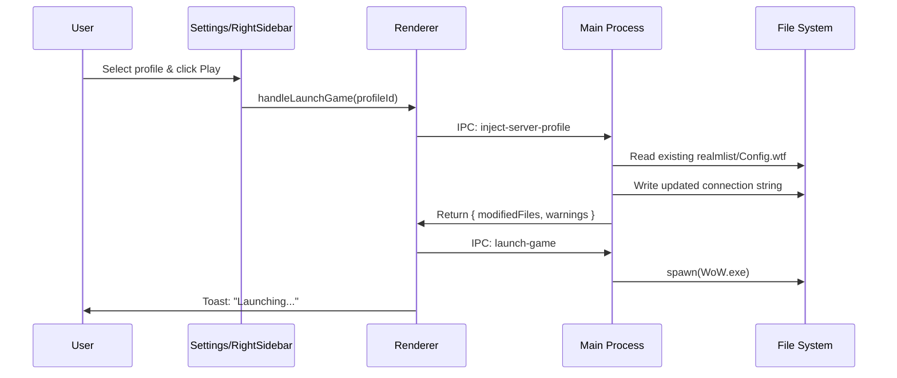

# Feature: Virtual Profile System

Status: In Progress
Owner: Zendevve
Created: 2025-12-19
Links: [8-Phase Implementation Plan](../../implementation_plan.md)

---

## Purpose

Enable seamless switching between private WoW servers from a single client installation. Users can connect to multiple private servers (Warmane, Turtle WoW, Stormforge, etc.) without manually editing realmlist.wtf or Config.wtf files.

---

## Scope

### In scope

- Server profile CRUD (create, read, update, delete)
- Automatic connection file detection (realmlist.wtf, Config.wtf)
- Connection string injection per expansion type
- Custom patcher detection for Cataclysm+
- Profile switching before game launch

### Out of scope

- Account management (username/password storage)
- Server population monitoring (Phase 8)
- Automatic server discovery

---

## Business Rules

1. Each profile links to exactly one WoW installation
2. Connection strings are injected into ALL locale folders found in Data/
3. For Vanilla (1.12), also write to root realmlist.wtf
4. For MoP (5.4.8), use `SET portal` in WTF/Config.wtf instead of realmlist
5. If custom patcher is detected (Cataclysm+), launch patcher instead of WoW.exe
6. Profile switching happens automatically on game launch if profile is selected
7. Never delete or overwrite other Config.wtf settings

---

## User Flows

### Primary flows

1. **Create Server Profile**
   - Actor: User
   - Trigger: Click "Add Server" in Settings
   - Steps: Enter name, select installation, enter connection string
   - Result: Profile saved and appears in profile list

2. **Switch Server Profile**
   - Actor: User
   - Trigger: Select profile from dropdown, click "Play"
   - Steps: System injects connection string, launches game
   - Result: Game connects to selected server

### Edge cases

| Scenario | Handling |
|----------|----------|
| No locale folders found | Write to root realmlist.wtf only, show warning |
| Config.wtf doesn't exist | Create it with portal entry only |
| Write permission denied | Show clear error, suggest running as admin |
| Multiple patchers found | Use first match, log warning |

---

## System Behaviour

- Entry points: Settings UI, RightSidebar profile selector, launch-game flow
- Reads from: Installation path, Data/ folder, WTF/ folder
- Writes to: realmlist.wtf files, Config.wtf
- Side effects: Modifies game configuration files
- Idempotency: Yes, re-injecting same string is idempotent
- Error handling: Toast notifications with actionable messages
- Security: No credentials stored, only server addresses

---

## Diagrams

---

## Components

| File | Role |
|------|------|
| `src/types/server-profile.ts` | Type definitions |
| `src/lib/utils/addon-utils.ts` | Parsing/injection utilities |
| `electron/main.ts` | IPC handlers for detection and injection |
| `src/services/electron.ts` | Frontend service layer |
| `src/services/storage.ts` | Profile persistence (localStorage) |
| `src/pages/Settings.tsx` | Profile management UI (TODO) |

---

## Verification

### Test environment

- Environment: Local development with mock WoW folder structure
- Data: Temp directories with sample realmlist.wtf and Config.wtf files

### Test commands

- build: `npm run build`
- test: `npm test`
- format: `npm run lint`

### Test flows

**Positive scenarios**

| ID | Description | Level | Expected result |
|----|-------------|-------|-----------------|
| POS-001 | Parse realmlist.wtf with `set realmlist` | Unit | Returns server address |
| POS-002 | Inject new address into existing realmlist | Unit | Replaces old address |
| POS-003 | Parse Config.wtf with `SET portal` | Unit | Returns portal value |
| POS-004 | Inject portal into Config.wtf | Unit | Replaces existing SET portal |
| POS-005 | Get realmlist paths for each expansion | Unit | Returns correct paths |

**Negative scenarios**

| ID | Description | Level | Expected result |
|----|-------------|-------|-----------------|
| NEG-001 | Parse empty realmlist | Unit | Returns null |
| NEG-002 | Inject into malformed Config.wtf | Unit | Appends without breaking |

**Edge cases**

| ID | Description | Level | Expected result |
|----|-------------|-------|-----------------|
| EDGE-001 | Locale folder validation | Unit | Matches enUS, rejects invalid |
| EDGE-002 | Sanitize -master suffix | Unit | Returns clean name |

### Test mapping

- Unit tests: `tests/unit/server-profile-utils.test.ts` (26 tests)
- Integration tests: Not yet implemented
- UI tests: Not yet implemented

---

## Definition of Done

- [x] Type definitions created (`ServerProfile`, `ConnectionFileInfo`, etc.)
- [x] Utility functions for realmlist/Config.wtf parsing and injection
- [x] IPC handlers in electron/main.ts
- [x] Service methods exposed to frontend
- [x] Unit tests for all parsing/injection logic (26 tests passing)
- [x] Storage service integration for profile persistence
- [x] Settings UI for profile management (ServerProfileSection)
- [x] Profile selector in RightSidebar with quick-switch dropdown
- [ ] Integration test with real file system
- [x] Feature documentation updated with final implementation
